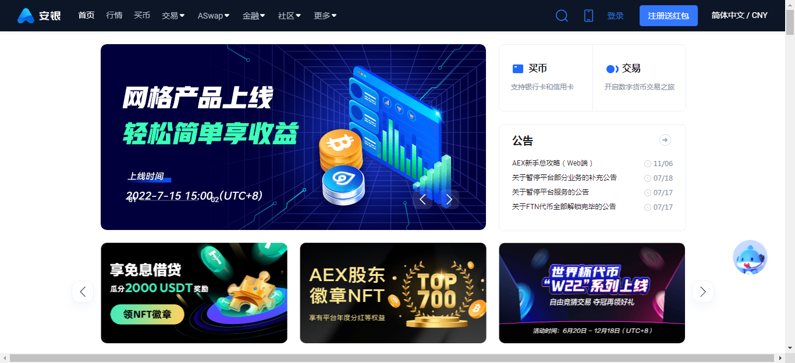

---
weight: 
title: "AEX交易所"
description: "Bit.cc注册于英国，是Bit World Investments Limited所运营的一家平台，提供区块链技术服务及数字资产交易。"
date: 2022-07-19T21:57:40+08:00
lastmod: 2022-07-19T16:45:40+08:00
draft: false
authors: ["fxx"]
featuredImage: "aexjiaoyisuo.webp"
link: "https://www.aex.com/"
tags: ["交易所","AEX交易所"]
categories: ["navigation"]
navigation: ["交易所"]
lightgallery: true
toc: true
pinned: false
recommend: false
recommend1: false
---
AEX，六年老牌资深国际站，集资讯社区、交易及金融理财服务为一体，拥有严格的资金管理系统，实行100%准备金制度，平台资金流向公开透明，已上线上百个交易对，用户注册数量近百万，在全球范围内拥有良好的业界口碑，被用户誉为业界最有良心的国际站。AEX致力于做用户最值得信赖的数字资产综合服务平台，不仅安全、稳定、高效、更贴心。

AEX安银创立于2013年，是最早期的一批交易所，至今已有将近8个年头，
作为区块链通证流通、交易的重要一环，AEX安银一直扮演着不可或缺的重要角色。
近年来，随着市场规模的增长以及各类加密货币衍生品的出现,AEX安银逐渐从早期撮合交易的定位,
朝着全球数字资产商业银行的方向发展蜕变，并倡导安全投资，稳健增值。

## 平台优势

##### 透明化运营

AEX 安银始终坚持中立不作恶原则，平台资金流向透明。目前已上线ATOM、DASH、VSYS、XTZ、XZC五个币种的准备金证明。所有业务数据实现透明化，币币交易、OTC交易、理财宝、借贷宝、算力宝等，设立专属资管岗位，开展透明化工作

#### 安全保障

2013年创立至今，AEX安银始终保持0例严重系统安全事故，以8年行业技术沉淀，时刻守护用户资产安全。已有的风控措施包括冷热钱包隔离、严格实施网络产研生产隔离、定期专业防渗透测试、特定代码采取访问隔离、智能分析系统预警异常变动等

#### 敏锐的市场服务

AEX安银团队时刻维持敏锐的市场观察力，能够快速、及时地反馈市场需求，上新各大热门投资币种及衍生服务，包括DeFi板块、NFT板块、DOT生态、DAO、DeFi机枪池、ETH联合挖矿等。在市场热点还未全面爆发之前，为众多用户提供抓住红利的机会

#### 九年老牌交易所

AEX安银创办于2013年，是全球领先的数字资产商业银行，致力于为百万用户提供数字资产管理服务。平台核心团队均为腾讯、猎豹系高管组成，在英国、新加坡、日本、香港等多个国家和地区均设有独立的交易业务和运营中心

